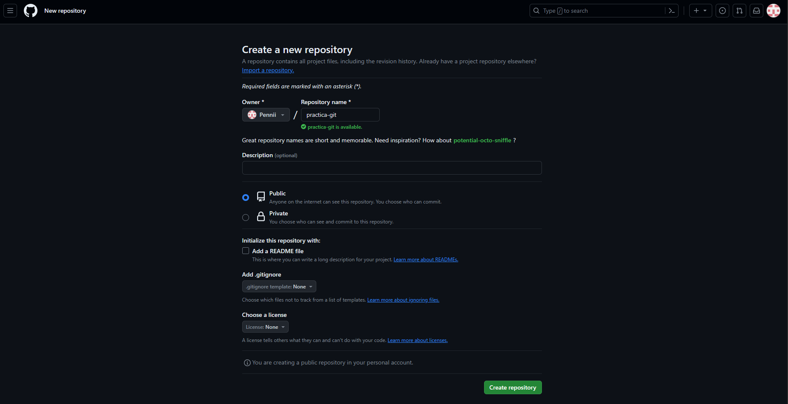

# Tarea: Practica Git, Markdown, Github

## Alumno: Matias Pennino
## Modulo: LMGSI
## Instituto: IES Aguadulce 2024

En este proyecto crearemos una pagina web utilizando *Github pages*, por lo tanto deberemos crear un repositorio en la misma pagina.

### Creacion del repositorio:

```
maniana@DAMDAW1-06 MINGW64 ~/desktop/practica-git
$ git init
Initialized empty Git repository in C:/Users/maniana/Desktop/practica-git/.git/
```

Una vez creado el mismo podremos empezar a realizar los respectivos commit que necesitemos. 

### Repositorio en Github:


En github crearemos un repositorio publico, ya que de otra forma, necesitariamos una cuenta de pago para utilizar *Github pages* en un repositorio privado. De igual forma, si es creado como privado, es posible modificarlo para que sea publico.