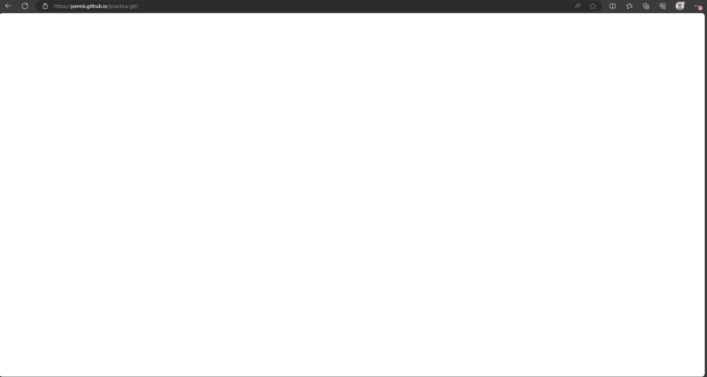

# Tarea: Practica Git, Markdown, Github

## Alumno: Matias Pennino
## Modulo: LMGSI
## Instituto: IES Aguadulce 2024
## Enlace a la pagina web: https://pennii.github.io/practica-git

En este proyecto crearemos una pagina web utilizando **Github pages**, por lo tanto deberemos crear un repositorio en la misma pagina.

### Creacion del repositorio:

```
maniana@DAMDAW1-06 MINGW64 ~/desktop/practica-git
$ git init
Initialized empty Git repository in C:/Users/maniana/Desktop/practica-git/.git/
```

Una vez creado el mismo podremos empezar a realizar los respectivos _commit_ que necesitemos. 

```
maniana@DAMDAW1-06 MINGW64 ~/desktop/practica-git (master)
$ git status
On branch master

No commits yet

Untracked files:
  (use "git add <file>..." to include in what will be committed)
        README.md
        images/
        index.html

nothing added to commit but untracked files present (use "git add" to track)

maniana@DAMDAW1-06 MINGW64 ~/desktop/practica-git (master)
$ git add .
```
Empezaremos por cargar el archivo **Index.html**, que aun esta vacio, la carpeta que utilizaremos para las imagenes, y el propio archivo **README** utilizando el comando *$git add .*, podriamos escribir uno por uno el nombre de los archivos a cargar, o podemos escribir un "." para cargar todos los archivos nuevos o modificados.
Siempre que se quiera se puede utilizar el comando *$git status* para vizualizar los cambios en los archivos

```
maniana@DAMDAW1-06 MINGW64 ~/desktop/practica-git (master)
$ git commit -m"Creacion de index.html y primeros pasos del proyecto"
[master (root-commit) c95ceaf] Creacion de index.html y primeros pasos del proyecto
 3 files changed, 22 insertions(+)
 create mode 100644 README.md
 create mode 100644 images/creacion_repositorio_git.png
 create mode 100644 index.html
```
Con el comando *$git commit -m* todos los archivos cargados seran guardados como una copia de seguridad. con el comando *$git log* y *$git log --oneline* podremos ver cada uno de estos puntos guardados.

```
maniana@DAMDAW1-06 MINGW64 ~/desktop/practica-git (master)
$ git log --oneline
c95ceaf (HEAD -> master) Creacion de index.html y primeros pasos del proyecto
```

### Repositorio en Github:


En github crearemos un repositorio publico, ya que de otra forma, necesitariamos una cuenta de pago para utilizar **Github pages** en un repositorio privado. De igual forma, si es creado como privado, es posible modificarlo para que sea publico.


Una vez creado podremos ver un enlace al mismo repositorio, de las dos opciones nosotros elegiremos utilizar el link **HTTPS**, y nos conectaremos a el utilizando el siguiente comando.
```
maniana@DAMDAW1-06 MINGW64 ~/desktop/practica-git (master)
$ git remote add origin https://github.com/Pennii/practica-git.git
```
De esta forma ya estaremos conectados al repositorio en **Github**.

Para poder subir las copias de seguridad a **Github** se utilizara el siguiente comando:
```
maniana@DAMDAW1-06 MINGW64 ~/desktop/practica-git (master)
$ git push origin master
```

Ya con esto podremos subir las copias de seguridad siempre que queramos.


En **Github** podremos ver cada *commit* realizado y en que momento se hizo.


Visual studio code tambien nos proporciona una herramienta para poder subir nuestros archivos a **Github**. Debemos ir al simbolo de ramas a la izquierda de la pantalla y nos permitira hacer de una manera mas amigable todos los comandos previos. Podemos hacer click en el simbolo + de cada elemento para añadirlo individualmente, o hacer click en el simbolo + de la linea *changes* para agregar todos los cambios. Una vez todos los cambios estan listos, se realiza el commit con el mensaje en la parte superior.


Al hacer el *commit* unicamente nos queda hacer el *push*, esto lo haremos haciendo click en el boton *Sync Changes* que nos indica la cantidad de cambios realizados. La primera vez que hagamos esto, veremos un boton que dira *Publish Branch*


### Github Pages:

Lo primero que haremos es establecer al profesor como colaborador del proyecto.


Para subir la pagina utilizaremos el directorio raiz del repositorio


Una vez configurada la direccion, **Github** subira la pagina automaticamente. Podremos ver cada despliegue en el apartado _deployments_




La pagina ahora esta en blanco, pero a medida que hagamos los *push*, esta se ira actualizando automaticamente.